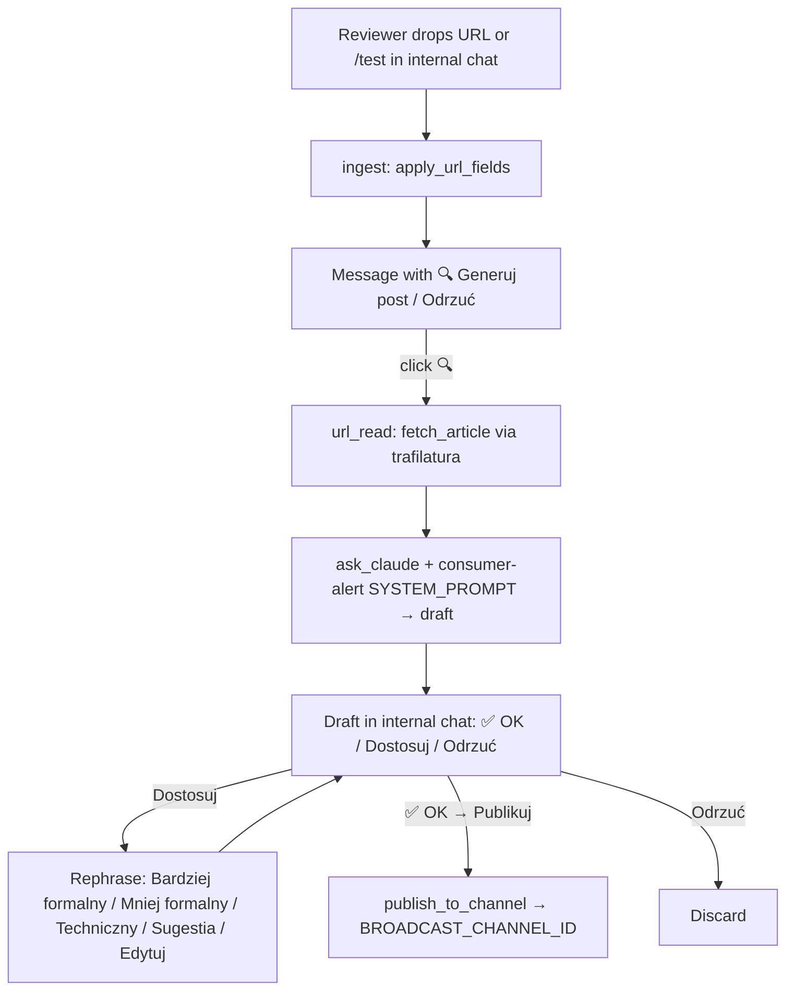
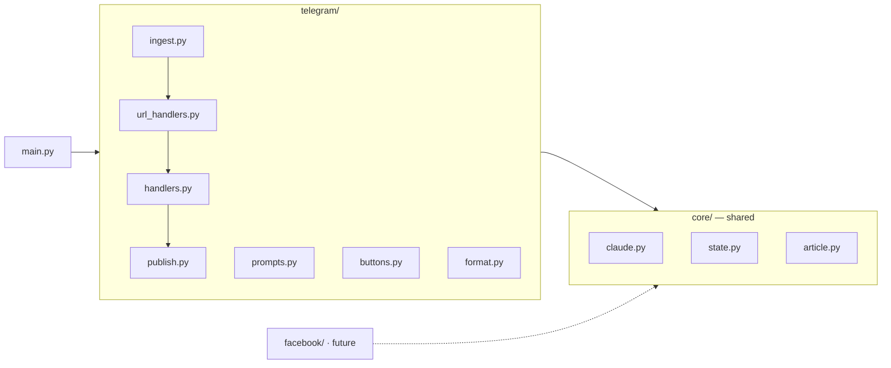
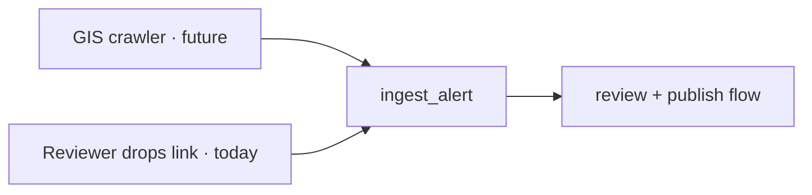

# Why it works this way

This bot exists to turn a **raw source** (a GIS/gov.pl alert page, or pasted text) into a
**polished, reviewed consumer-alert post** on a public Telegram channel — with a human in the loop.

## Two places: your DM → broadcast

- **Internal review = your direct chat with the bot.** You paste links / send `/test`, the bot
  DMs back drafts, and you accept or decline right there. Nothing here is public.
- **Broadcast channel** = the shop window. Only approved, final alerts land here.

Keeping the workshop (your DM) separate from the channel means mistakes never reach subscribers.

## One bot, not two

We don't monitor other Telegram channels, so there's no need for a *user account* (userbot). A
single **bot** — admin in both chats — posts drafts, handles button clicks, and publishes. Login is
just the bot token: no phone number, no 2FA.

## Click-to-generate (no auto, no preview card)

A dropped link doesn't immediately burn a Claude call. It gets a single **🔍 Generuj post** button;
generation happens only when a reviewer clicks. There's intentionally **no raw-text preview card** —
just the trigger, then the finished draft.

## Message flow

`/test` seeds a sample alert and `/new <text>` injects arbitrary text; both share the same path, so
plain-text items (no URL) are summarized directly instead of being fetched.

## Module architecture

Shared, platform-agnostic code lives in `core/`; anything Telegram-specific is isolated in
`telegram/`. New platforms (e.g. `facebook/`) are added as sibling directories that reuse `core/`
— without touching the Telegram code.

## State & restarts

`core/state.py` keeps two dicts — `pending_adoption` (items awaiting 🔍) and `pending_posts`
(drafts under review) — and mirrors every change to `state.json`. If the bot restarts, in-flight
drafts survive (Telethon message objects are runtime-only and simply re-fetched on demand).

## Future: automatic GIS crawler

Today a human drops the link. Later, a crawler that watches GIS/gov.pl will call the same
`ingest_alert()` entry point when a new notification appears — so the review/publish machinery
downstream doesn't change at all.

